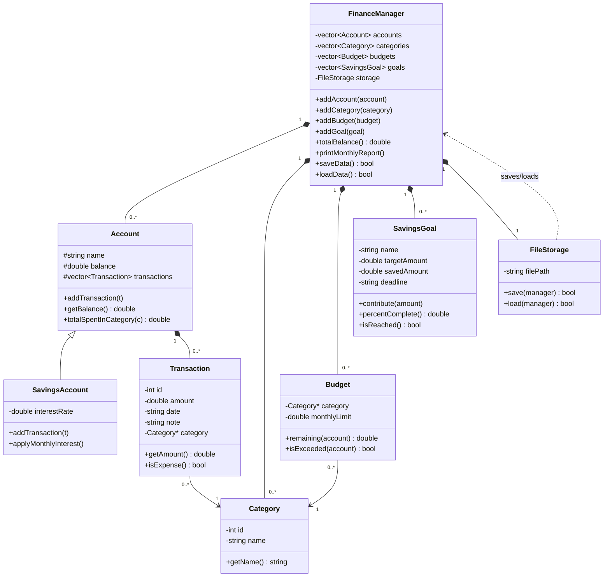

# Personal Finance Manager

A C++ program that helps people track accounts, budgets and savings goals.

## Class Diagram

```mermaid
classDiagram
    class FinanceManager {
        -vector~Account~ accounts
        -vector~Category~ categories
        -vector~Budget~ budgets
        -vector~SavingsGoal~ goals
        -FileStorage storage
        +addAccount(account)
        +addCategory(category)
        +addBudget(budget)
        +addGoal(goal)
        +totalBalance() double
        +printMonthlyReport()
        +saveData() bool
        +loadData() bool
    }
    class Account {
        #string name
        #double balance
        #vector~Transaction~ transactions
        +addTransaction(t)
        +getBalance() double
        +totalSpentInCategory(c) double
    }
    class SavingsAccount {
        -double interestRate
        +addTransaction(t)
        +applyMonthlyInterest()
    }
    class Transaction {
        -int id
        -double amount
        -string date
        -string note
        -Category* category
        +getAmount() double
        +isExpense() bool
    }
    class Category {
        -int id
        -string name
        +getName() string
    }
    class Budget {
        -Category* category
        -double monthlyLimit
        +remaining(account) double
        +isExceeded(account) bool
    }
    class SavingsGoal {
        -string name
        -double targetAmount
        -double savedAmount
        -string deadline
        +contribute(amount)
        +percentComplete() double
        +isReached() bool
    }
    class FileStorage {
        -string filePath
        +save(manager) bool
        +load(manager) bool
    }

    Account <|-- SavingsAccount
    FinanceManager "1" *-- "0..*" Account
    FinanceManager "1" *-- "0..*" Category
    FinanceManager "1" *-- "0..*" Budget
    FinanceManager "1" *-- "0..*" SavingsGoal
    FinanceManager "1" *-- "1" FileStorage
    Account "1" *-- "0..*" Transaction
    Transaction "0..*" --> "1" Category
    Budget "0..*" --> "1" Category
    FileStorage ..> FinanceManager : saves/loads
```
